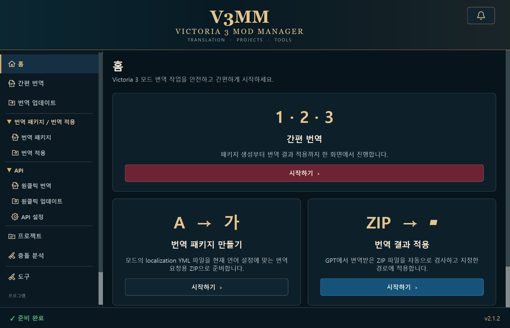
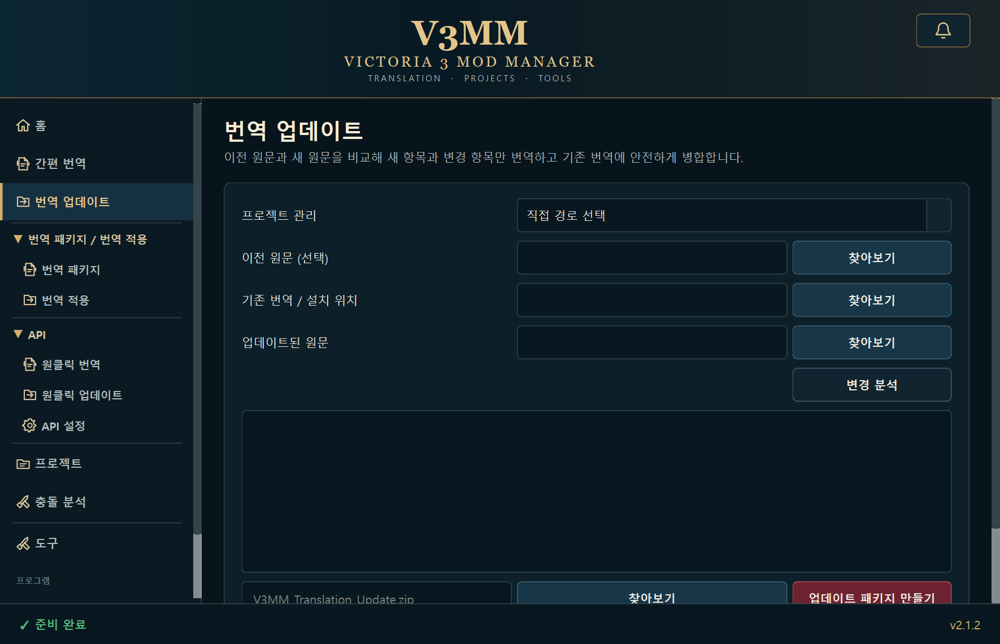

[English](README.md) | **한국어**

# Victoria 3 Mod Manager

Victoria 3 모드의 localization 파일을 선택한 언어의 AI 번역용 ZIP으로 만들고, 반환된 번역 ZIP을 안전하게 검증·설치하는 Windows GUI 프로그램입니다.



## 다운로드

- [현재 Windows EXE 바로 받기](download/Victoria3ModManager.exe)
- [GitHub Releases 열기](https://github.com/blor123/Victoria-3-Mod-Translation-Tool/releases/latest)

Python 설치 없이 `Victoria3ModManager.exe`를 실행할 수 있습니다. 기존 설정과 프로젝트 정보는 `%LOCALAPPDATA%\Victoria3ModManager`에 유지됩니다.

## v2.1.2 기능

- 사이드바의 `번역 업데이트`를 `간편 번역` 바로 아래에 배치
- v2.1.1 Gemini Authorization Key/Interactions API 호환 수정 포함
- 앱 종료 후 늦게 도착한 업데이트 확인 콜백을 안전하게 무시



## v2.1.1 기능

- Google AI Studio의 `AQ.` Authorization Key와 호환되는 Gemini Interactions API 사용
- 연결 테스트의 401 인증 실패와 403 프로젝트 권한 거부 안내 개선
- 기본 권장 모델을 `gemini-3.8-flash`로 갱신하고 기존 2.x 모델 설정을 연결 시 자동 보정

## v2.1.0 기능

### Gemini API(BYOK)

- Google Gemini API Key를 사용한 원클릭 Localization 번역
- Snapshot의 `NEW`/`CHANGED`만 전송하는 원클릭 번역 업데이트
- Provider 인터페이스와 번역/충돌 AI Service 분리
- API Key를 `config.json`이 아닌 Windows Credential Manager에 저장
- 보호 토큰 치환·복원, 자동 Batch, 429 대기/재시도, 중지와 부분 실패 보존
- API 응답을 별도 미리보기 폴더에 구성하고 원본 Localization은 수정하지 않음

### Local Conflict Analyzer

- Gemini API Key 없이 작동하는 읽기 전용 충돌 분석
- 동일 상대 경로 파일의 SHA-256 비교와 동일/상이 내용 분류
- 언어별 Localization Key/Value 중복 분석
- 주석, 문자열, 중첩 중괄호를 고려한 최상위 Victoria 3 Definition 분석
- descriptor의 `replace_path`와 다른 Mod 파일 영역 중첩 경고
- 개별 Parser 오류 격리와 Evidence 중심 결과
- 검색·유형 필터·좌우 Diff·JSON Report 저장
- 선택한 충돌 코드 조각만 전송하는 선택적 Gemini 심층 분석과 내용 기반 Cache

기존 수동 번역, ZIP 생성/적용, 안전 검사, 백업, 프로젝트, 알림, 업데이트 확인 기능은 유지됩니다. v2.1 UI에서는 계획에 따라 v1.7/v1.8의 Mod Import/Library/Loadout 메뉴를 제거했습니다. Steam 또는 Paradox Launcher 설정은 수정하지 않습니다.

### v1.8.0 기반 기능

- 가져온 모드를 한곳에서 검색·필터·정렬하는 Mod Library
- Steam/Local 출처, Workshop ID, Localization, 연결 프로젝트와 번역 상태 표시
- 라이브러리에서 프로젝트 연결, 번역 패키지 생성, 번역 업데이트 화면으로 바로 이동
- 현재 가져온 Playset 순서와 활성 상태를 V3MM 내부 Loadout으로 저장
- Loadout 생성·전환·삭제와 `v3mm_loadout` JSON 가져오기·내보내기
- 향후 v2.0 충돌 분석에서 재사용할 수 있는 읽기 전용 Mod 파일 인덱스
- 외부 Launcher/Steam 설정은 변경하지 않는 안전한 내부 상태 관리

### v1.7.0 기반 기능

- 로컬 Steam 설치 경로와 Library VDF를 통한 Victoria 3 Workshop Mod 자동 탐색
- Steam 인증정보/API 없이 이미 다운로드된 `workshop/content/529340` Mod 읽기
- Paradox Launcher SQLite를 `mode=ro`와 `query_only`로 여는 읽기 전용 Mod/Playset 가져오기
- Launcher 형식 인식 실패 시 폴더/JSON 가져오기 안내와 기존 번역 기능 격리
- 수동 Mod 폴더 및 `.mod` descriptor 가져오기
- `v3mm_mod_list` JSON 가져오기·내보내기
- 최상위 배열, `mods`/`mod_list`/`items`/`entries`, Launcher registry, `enabled_mods` 등 다양한 JSON 형식 호환
- 이름, Source, Workshop ID, 경로, Localization, 활성 상태, Load Order 공통 `ModEntry`
- 가져온 Mod 목록의 사용자 설정 저장과 중복 통합
- 접힘 상태는 위쪽, 펼침 상태는 아래쪽 꼭짓점을 갖는 SVG 카테고리 삼각형

### v1.6.0 기반 기능

- 기본 창에서 모두 보이는 재구성 사이드바와 접이식 `번역 패키지 / 번역 적용` 그룹
- 패키지 생성, 5개 언어 AI 지침, 결과 적용을 한 화면에서 처리하는 간편 번역
- UI/목표 언어와 독립적으로 선택·저장되는 5개 번역 지침 언어
- 스냅샷 기반 NEW/CHANGED/DELETED/UNCHANGED 번역 업데이트
- 스냅샷이 없는 프로젝트를 위한 보수적인 키 전용 레거시 비교
- 기존 번역 유지·교체·추가와 삭제 원문 번역 보존을 지원하는 백업 우선 병합
- 알림 버튼 기준 동적 크기·창 경계 보정 알림 센터
- 향후 Steam/Paradox/JSON 읽기 전용 연동을 위한 `ModSourceProvider`/`ModEntry` 기반

- 프로젝트별 Localization Snapshot과 NEW/CHANGED/DELETED/UNCHANGED 비교
- 새 항목과 변경 항목만 포함하는 대상 언어별 증분 번역 ZIP
- 단계형 프로젝트 생성/수정 Wizard와 Localization 자동 감지
- Settings 반응형 Scroll UI와 모든 경로의 초기화/전체 초기화
- 알림 일회성 마이그레이션으로 삭제 상태 영구 보존
- Font Glyph에 의존하지 않는 SVG 알림 및 사이드바 아이콘

- UI 언어에 연동된 번역 대상 언어(한국어, English, 日本語, 简体中文, 繁體中文)
- 파일명·localization 헤더 독립 변환, 소스 언어 감지, 충돌 차단
- 원본 manifest를 이용한 반환 ZIP의 파일·KEY·보호 토큰 검증
- 프로젝트 생성·수정·삭제 및 경로 자동 채우기
- 최근 작업과 우측 알림 센터의 단일 데이터 저장소, 개별/전체 지우기
- GitHub Releases 업데이트 확인(선택적 시작 확인, 24시간 캐시, Release 페이지 열기)

- 참고 디자인을 반영한 Dark Victorian 테마와 V3MM 브랜딩
- 상단 브랜딩, 좌측 사이드바, 페이지 전환, 하단 작업 상태 표시
- 홈 화면 기능 카드와 최근 작업 5개 표시
- 번역 패키지 생성과 번역 적용의 독립 페이지
- 설정, 정보, 프로젝트/도구 예정 페이지
- 100%, 125%, 150% Windows 배율 대응 레이아웃
- 멀티사이즈 V3MM Windows 앱 아이콘

v1.0에서 제공하던 다음 코어 기능은 그대로 유지합니다.

- 단일/복수 YML, `english`/`localization` 폴더, 모드 폴더 선택
- `_english.yml` → `_korean.yml` 파일명 변환
- `localization/korean` 폴더 구조 유지
- 원본 파일은 byte 수준으로 보존하고 ZIP 복사본의 `l_english:` 선언만 최소 변경
- 5개 언어 UI(한국어, English, 简体中文, 繁體中文, 日本語)와 즉시 전환
- 파일·폴더 드래그 앤 드롭 및 번역 대상 미리보기
- `l_english:` 선언만 `l_korean:`으로 최소 변경하고 원본 보존
- Prompt v4 확인·편집·복사·언어별 기본값 복원
- 이름과 최상위 래퍼 폴더에 무관한 번역 ZIP 탐색
- Zip Slip, 심볼릭 링크, 암호화 ZIP, 과도한 압축 해제 크기 차단
- 설치 전 파일 목록/중복 확인
- 백업 후 덮어쓰기(기본), 덮어쓰기, 건너뛰기, 취소
- `%LOCALAPPDATA%\Victoria3ModManager`에 설정과 순환 로그 저장
- 오래된 전용 임시 작업 폴더 정리

프로그램은 ChatGPT 로그인 정보, 쿠키 또는 세션 토큰을 요구하거나 저장하지 않습니다. 사용자가 직접 입력한 Gemini API 키는 일반 설정 파일이 아닌 Windows Credential Manager에만 저장합니다.

## 개발 환경 실행

Python 3.11 이상을 권장합니다.

```powershell
python -m venv .venv
.venv\Scripts\Activate.ps1
python -m pip install -r requirements.txt
python main.py
```

## 테스트

```powershell
python -m unittest discover -s tests -v
```

테스트는 코어 로직뿐 아니라 새 GUI와 코어의 연결, 페이지 전환, 설정과 최근 작업 기록도 검증합니다.

## Windows EXE 빌드

프로젝트 루트에서 다음을 실행합니다.

```powershell
powershell -ExecutionPolicy Bypass -File scripts\build_windows.ps1
```

스크립트는 전용 가상 환경을 만들고 테스트를 통과한 뒤 `dist\Victoria3ModManager.exe`를 생성합니다. EXE 실행에는 사용자 PC의 Python 설치가 필요하지 않습니다.

빌드 설정은 다른 프로그램의 UCRT/ICU DLL이 PATH를 통해 잘못 포함되지 않도록 Windows 시스템 제공 `ucrtbase.dll`, `api-ms-win-crt-*`, `icuuc.dll`, `icudt*.dll`을 패키징 대상에서 제외합니다.

## 버전

- Application Version: 2.1.2
- Translation Workflow Version: 5
- Prompt Version: 4

사용자 수정 프롬프트는 설정 파일에 별도로 저장되므로 EXE를 교체해도 유지됩니다.

## EXE 업데이트 방안

각 버전은 Python 소스가 아니라 단일 `Victoria3ModManager.exe`로 배포할 수 있습니다. 사용자 설정과 로그는 EXE 밖의 `%LOCALAPPDATA%\Victoria3ModManager`에 있으므로 프로그램을 종료하고 새 EXE로 교체해도 기존 설정이 유지됩니다.

실행 중인 프로그램이 자기 EXE를 직접 덮어쓰는 방식은 파일 잠금과 업데이트 실패 시 복구 문제 때문에 사용하지 않습니다. 초기 업데이트 방식은 다음과 같이 단순하게 유지합니다.

1. 새 버전 EXE를 내려받습니다.
2. 실행 중인 Victoria 3 Mod Manager를 종료합니다.
3. 기존 EXE를 새 EXE로 교체합니다.
4. 기존 사용자 설정을 그대로 불러와 실행합니다.

향후 자동 업데이트가 필요하면 별도의 updater 실행 파일이 새 버전의 해시 또는 전자서명을 검증한 후 본 프로그램이 종료된 상태에서 교체하도록 구현합니다.
